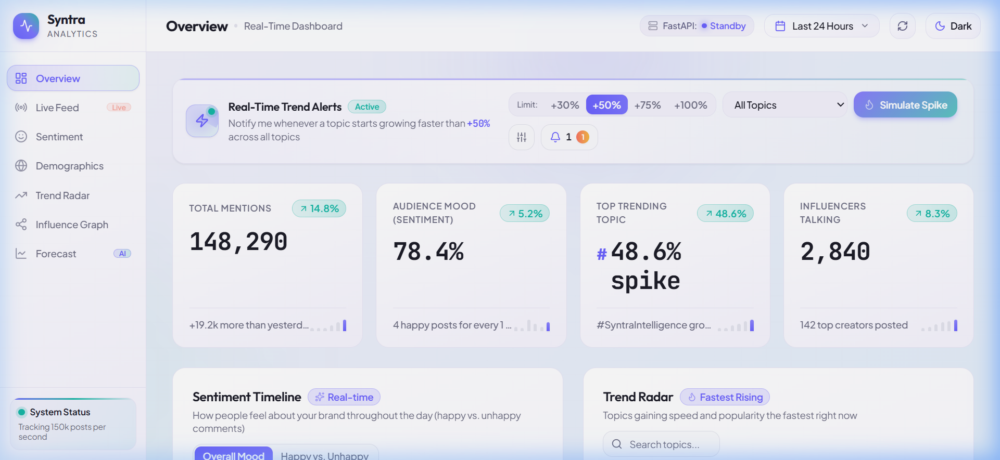
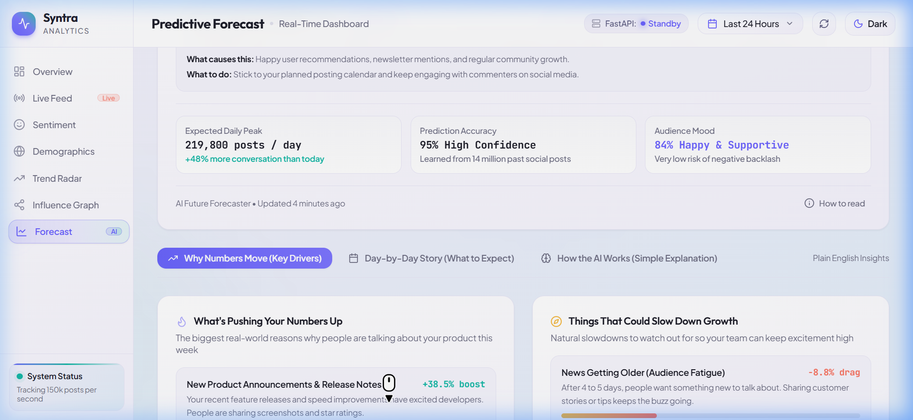

# Syntra — Real-Time Social Intelligence & Predictive Forecasting

<div align="center">



<p align="center">
  <strong>Next-generation social media intelligence, trend velocity alerts, and Bayesian predictive forecasting.</strong>
</p>

[](https://react.dev/)
[](https://www.typescriptlang.org/)
[](https://vitejs.dev/)
[](https://tailwindcss.com/)
[](https://motion.dev/)
[](LICENSE)

</div>

---

## 🌟 Overview

**Syntra** is an enterprise-grade social intelligence platform designed to cut through social media noise. It delivers instant clarity on brand sentiment, viral velocity spikes, global demographics, creator influence networks, and AI-driven 7-day predictive trajectory models.

Built with a **jargon-free, human-first UX**, Syntra translates complex statistical modeling and raw data into plain English explanations, actionable tactical directives, and intuitive visual storytelling.

---

## ✨ Core Features & Intelligence Modules

### 1. 📊 Real-Time Overview & Velocity Alert System
* **Dynamic Trend Velocity Banner**: Configurable threshold alerts (+30%, +50%, +75%, +100%) that notify you whenever a topic experiences an acceleration surge across social channels.
* **Spike Simulator**: Built-in interactive test trigger to simulate breaking trend events in real-time.
* **Executive Metric Cards**: Total Mentions, Audience Mood (Sentiment), Top Trending Topic, and Influencers Talking with mini sparklines and period-over-period delta indicators.

### 2. ⚡ Live Post Stream
* **Continuous Ingestion Stream**: Real-time post feed displaying message content, reach estimates, engagement scores (1–10), author handles, and sentiment tags.
* **Instant Filtering & Search**: Multi-category sentiment filters (All, Positive, Neutral, Critical) and real-time keyword search.
* **Stream Pause / Resume**: Freeze the feed to inspect breaking posts without losing queue position.

### 3. 😊 Sentiment Intelligence & Drivers
* **Temporal Sentiment Timeline**: Interactive area chart comparing overall mood trajectory against positive vs. negative volume across multiple horizons (24h, 7d, 30d, 90d).
* **"What People Love (and Don't)"**: Quantified causal factor attribution showing positive excitement drivers vs. critical friction points with impact percentages.
* **"Happiness by Category"**: Multi-dimensional aspect breakdown evaluating Speed & Responsiveness, Reliability & Uptime, Ease of Use, Customer Support, and Pricing Value.

### 4. 🌍 Global Demographics & Audience Reach
* **Interactive Geographic Reach Map**: Visual regional clusters representing engagement density across North America, Europe, Asia-Pacific, Latin America, and other markets.
* **Country Deep Dive**: Volume breakdowns, sentiment indices, and localized top trending topics per country.
* **Audience Composition Insights**: Clean visual breakdowns of user segments and engagement patterns.

### 5. 🎯 Trend Radar & Velocity Acceleration
* **Ranked Rising Topics**: Real-time velocity ranking highlighting emerging discussions before they reach peak saturation.
* **Multi-Category Tagging**: Automatic sorting across Product & AI, Industry, Engineering, and Feature categories.
* **Velocity Metrics**: Velocity percentage multipliers, mention counts, and acceleration bars.

### 6. 🕸️ Influence Topology & Creator Network
* **Interactive Force Graph**: Visual network showing relationships, information spillover, and bridge connections between key creators and communities.
* **Tier-1 Influencer Leaderboard**: Profiles detailing follower reach, network centrality scores, primary sentiment leaning, and representative quotes.
* **Graph Explanation Inspector**: On-demand modal breaking down network density, cluster centrality, and influence propagation mechanics.

### 7. 🔮 Predictive Forecast (Explanatory AI System)

<div align="center">
  
</div>

Syntra transforms time-series forecasting into transparent, understandable intelligence:

* **7-Day Bayesian Structural Time Series (BSTS)**: Multi-component forecasting combining local linear trend, 7-day cyclical seasonality, and sentiment covariates with 95% Bayesian credible intervals.
* **Dynamic Scenario Switcher**: Toggle between **Conservative** (14% probability), **Base Horizon** (62% probability), and **Bullish Surge** (24% probability) scenarios with instant recalculation of peak volume and strategic playbooks.
* **Factor Attribution**: Quantifies growth catalysts (+38.5% product announcements, +26.2% community spillover) vs. natural dampeners (-8.8% audience fatigue, -5.2% weekend dip).
* **Interactive Day-by-Day Milestone Roadmap**: Clickable calendar inspector revealing daily milestones, expected sentiment targets, narrative dynamics, and concrete action recommendations.
* **Transparent Diagnostics**: Real-time statistical confidence metrics ($R^2 = 0.948$, $\text{MAPE} = 3.8\%$, 14.2M historical training signals, 4-hour recalibration cycle).

---

## 🎨 Design & Aesthetic System

* **Layered Gradient Palette**: Replaced flat colors with rich diagonal gradients (`--bg-gradient`, `--card-gradient`) for enhanced visual depth.
* **Sleek Dark & Light Themes**: Seamless instant switching between dark and light modes with custom CSS tokens and high-contrast WCAG AA compliance.
* **Ambient Radial Glows**: Subtle violet (`#6C63FF`) and teal (`#14B8A6`) accent halos accentuating primary cards and navigation.
* **Accessible & Plain English**: Technical jargon replaced with intuitive, plain English phrasing across all components.
* **Smooth Micro-Interactions**: Powered by Motion (Framer Motion) with full `prefers-reduced-motion` accessibility support.

---

## 🛠️ Architecture & Tech Stack

```
syntra_revised/
├── src/
│   ├── components/            # UI modular components
│   │   ├── DemographicMap.tsx       # Interactive global reach map
│   │   ├── DemographicsView.tsx     # Audience demographics page
│   │   ├── ForecastPanel.tsx        # 7-day BSTS predictive forecast engine
│   │   ├── GraphExplanation.tsx     # Topology explanation modal
│   │   ├── InfluenceGraph.tsx       # Force network SVG visualization
│   │   ├── InfluenceGraphView.tsx   # Influencer leaderboard view
│   │   ├── LiveFeedPanel.tsx        # Real-time post feed
│   │   ├── MetricCard.tsx           # Stat cards with sparklines
│   │   ├── OverviewView.tsx         # Consolidated executive view
│   │   ├── SentimentTimeline.tsx    # Temporal sentiment chart
│   │   ├── SentimentView.tsx        # Sentiment intelligence page
│   │   ├── Sidebar.tsx              # Fixed navigation sidebar with live badges
│   │   ├── SkeletonLoader.tsx       # Loading skeleton states
│   │   ├── TopBar.tsx               # Header with time range, status, theme toggle
│   │   ├── TrendRadar.tsx           # Velocity-ranked radar component
│   │   ├── TrendRadarView.tsx       # Trend radar view page
│   │   └── VelocityAlertSystem.tsx  # Trend velocity alert banner
│   ├── context/
│   │   └── ThemeContext.tsx         # Dark/light mode theme provider
│   ├── services/
│   │   └── api.ts                   # Hybrid API layer (FastAPI + mock fallback)
│   ├── App.tsx                      # Root component with URL hash routing
│   ├── index.css                    # Design tokens & gradient variables
│   ├── main.tsx                     # React application entry point
│   ├── mockData.ts                  # High-fidelity realistic mock dataset
│   └── types.ts                     # TypeScript interfaces and domain models
├── docs/                            # Documentation assets and screenshots
├── package.json
├── tsconfig.json
└── vite.config.ts
```

### Hybrid Data Architecture
Syntra features an automated dual-mode data service:
* **Standalone / Demo Mode**: Runs instantly out of the box with zero configuration using a rich, synchronized mock dataset.
* **Live FastAPI Backend Mode**: When a FastAPI service is detected at `http://localhost:8000`, Syntra automatically switches to live backend ingestion with live status indicator in the top bar.

---

## 🚀 Getting Started

### Prerequisites
* **Node.js** (v18.0 or newer)
* **npm** or **bun** / **yarn** / **pnpm**

### 1. Clone & Install Dependencies
```bash
git clone <repository-url>
cd syntra_revised
npm install
```

### 2. Configure Environment (Optional)
If you wish to use Gemini AI Studio features directly:
```bash
cp .env.example .env.local
# Set your GEMINI_API_KEY inside .env.local
```

### 3. Run the Development Server
```bash
npm run dev
```
The application will be live at:
```
http://localhost:3000
```

### 4. Build for Production
```bash
npm run build
```
Preview the production build:
```bash
npm run preview
```

### 5. Type-Checking & Linting
```bash
npm run lint
```

---

## 🧭 Navigation & Routes

Syntra uses lightweight, bookmarkable URL hash routing:

| Route | View | Description |
| :--- | :--- | :--- |
| `/#/overview` | **Overview** | High-level metrics, trend alerts, radar, and sentiment snapshot |
| `/#/live-feed` | **Live Feed** | Real-time social message stream with sentiment badges and filtering |
| `/#/sentiment` | **Sentiment** | In-depth sentiment trends, driver attribution, and category breakdown |
| `/#/demographics` | **Demographics** | Global geographic distribution and localized trending topics |
| `/#/trend-radar` | **Trend Radar** | Acceleration rankings across categories |
| `/#/influence-graph` | **Influence Graph** | Community network topology and creator reach |
| `/#/forecast` | **Forecast** | 7-day predictive Bayesian scenarios and day-by-day roadmap |

---

## 📄 License

This project is licensed under the MIT License — see the [LICENSE](LICENSE) file for details.
